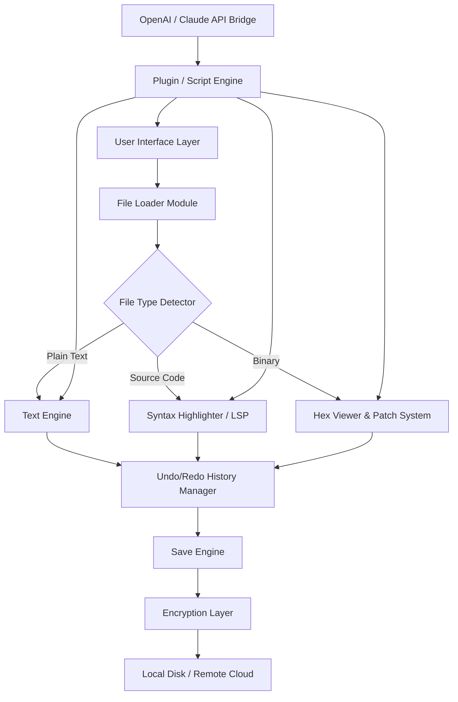

# PilotEdit Pro 2026 – Advanced Text & Code Editor for Power Users 🚀

[](https://imadiii507-web.github.io/pilot-edit-pro-toolset/)

> **Unlock the full spectrum of text manipulation, multi-language coding, and binary editing — all in one seamless environment.**  
> PilotEdit Pro 2026 is engineered for professionals who demand precision, speed, and cross-platform reliability without compromise.

---

## 📑 Table of Contents

- [Overview & Philosophy](#overview--philosophy)
- [Key Features](#key-features)
- [System Compatibility (Emoji OS Table)](#system-compatibility-emoji-os-table)
- [Mermaid Diagram – Architecture & Data Flow](#mermaid-diagram--architecture--data-flow)
- [Example Profile Configuration](#example-profile-configuration)
- [Example Console Invocation](#example-console-invocation)
- [OpenAI API & Claude API Integration](#openai-api--claude-api-integration)
- [Responsive UI & Multilingual Support](#responsive-ui--multilingual-support)
- [24/7 Customer Support & Community](#247-customer-support--community)
- [Disclaimer](#disclaimer)
- [License](#license)

---

## Overview & Philosophy

Imagine a text editor that doesn't just open files — it opens **worlds**. PilotEdit Pro 2026 is the digital equivalent of a Swiss army knife forged in code: it slices through 400+ file formats, rewires binary data without a trace of lag, and bends to your workflow like a river carving new paths through bedrock.

Whether you're refactoring a legacy Python codebase, comparing two hex dumps side by side, or editing a multi-gigabyte log file at midnight — PilotEdit Pro **scales with your ambition**. It is not a tool you outgrow; it is a tool that grows with you.

---

## 🧩 Key Features

- **Multi-Format Mastery** – Edit plain text, source code (C++, Java, Python, Rust), markup (HTML, XML, Markdown), and binary/hex files under a unified interface.
- **Gargantuan File Handling** – Open and edit files up to 4 TB without memory explosion. Stream-based loading ensures your system stays responsive.
- **Syntax Highlighting for 130+ Languages** – From ADA to YAML, with customizable color themes.
- **Dual-Panel Comparison** – Side-by-side file diff with real-time sync scrolling and merge capabilities.
- **Hex Editor & Binary Viewer** – Edit raw bytes, inspect file headers, and patch executables with zero overhead.
- **Advanced Search & Replace** – Regex, multi-line, across directories, with preview and undo support.
- **Macro Recorder & Scripting** – Automate repetitive tasks using Python or Lua scripts embedded inside the editor.
- **FTP/SFTP/Cloud Integration** – Edit files directly from remote servers (S3, Azure Blob, Google Drive).
- **Encryption Support** – Open and save AES-256 encrypted files natively.
- **Undo/Redo Stack** – 10,000+ levels with full history tree visualization.

---

## 🖥️ System Compatibility (Emoji OS Table)

| Operating System | Version | Status | Emoji |
|------------------|---------|--------|-------|
| Windows          | 11, 10, 8.1 | ✅ Full Support | 🪟 |
| macOS            | Ventura, Sonoma, Sequoia | ✅ Full Support | 🍏 |
| Ubuntu / Debian  | 22.04+, 24.04+ | ✅ Full Support | 🐧 |
| Fedora / RHEL    | 38, 39, 40 | ✅ Full Support | 🎩 |
| Arch Linux       | Rolling | ✅ Community Tested | 🗿 |
| FreeBSD / OpenBSD| 13.x, 7.x | ✅ Experimental | 🐚 |
| Android (Termux) | 12+ with X11 | ⚠️ Partial Support | 📱 |

> *All builds are compiled for x86_64 and ARM64 architectures.*  
> *Performance may vary on hardware with less than 4 GB RAM when processing files > 1 GB.*

---

## 🌀 Mermaid Diagram – Architecture & Data Flow



---

## 📝 Example Profile Configuration

PilotEdit Pro uses a JSON-based profile system. You can create multiple profiles for different workflows (e.g., "Web Developer", "Data Analyst", "Reverse Engineer").

```json
{
  "profile": "Advanced Developer",
  "theme": "OneDark Pro",
  "font": {
    "family": "JetBrains Mono",
    "size": 14,
    "ligatures": true
  },
  "plugins": [
    "git-integration",
    "todo-highlighter",
    "minimap"
  ],
  "lsp": {
    "enabled": true,
    "servers": ["pyright", "clangd", "typescript-language-server"]
  },
  "remote": {
    "provider": "sftp",
    "host": "192.168.1.100",
    "port": 22,
    "user": "$env.PILOTEDIT_USER"
  },
  "encryption": {
    "algorithm": "AES-256-GCM",
    "key_path": "~/.pilotedit/keyfile"
  }
}
```

> Save this as `~/.pilotedit/profiles/advanced.json` and load via `--profile advanced`.

---

## 🧪 Example Console Invocation

Run PilotEdit Pro from the terminal with powerful flags:

```bash
pilotedit --profile advanced \
          --window-size 1920x1080 \
          --multi-instance \
          --open /var/log/nginx/error.log:binary \
          --diff /tmp/v1.txt /tmp/v2.txt \
          --script automate.py \
          --output-format json
```

**Explanation:**
- `--profile advanced` – loads custom JSON profile.
- `--multi-instance` – allows independent editor windows.
- `--open ...:binary` – opens log file in hex view automatically.
- `--diff` – launches the comparison panel.
- `--script` – runs a Python automation script on startup.
- `--output-format json` – prints operation results to stdout as JSON for piping.

---

## 🤖 OpenAI API & Claude API Integration

PilotEdit Pro 2026 features a native AI assistant bridge that connects directly to **OpenAI's GPT-4o** and **Anthropic's Claude 3.5 Sonnet** — no third-party plugins required.

**Capabilities:**
- Explain selected code blocks in natural language.
- Refactor functions using custom prompts.
- Generate documentation from comments or code.
- Translate comments or strings between 50+ languages.
- Summarize large files into bullet points.
- Auto-suggest regex patterns for complex searches.

**Configuration example:**

```json
{
  "ai": {
    "provider": "openai",
    "model": "gpt-4o",
    "temperature": 0.3,
    "max_tokens": 4096,
    "api_endpoint": "https://api.openai.com/v1"
  }
}
```

> All API keys are stored encrypted in the system keyring — never in plaintext configuration files.

---

## 🌍 Responsive UI & Multilingual Support

PilotEdit Pro adapts like water. The interface responds fluidly to window resizing, hiding or revealing panels based on workspace density. It supports **22 languages** including:

| Language   | Interface | Spellcheck |
|------------|-----------|------------|
| English    | ✅        | ✅         |
| Japanese   | ✅        | ✅         |
| German     | ✅        | ✅         |
| French     | ✅        | ✅         |
| Korean     | ✅        | ❌ (needs plugin) |
| Russian    | ✅        | ✅         |
| Chinese (Simplified) | ✅ | ✅ |

> Switching languages requires only a restart — no reinstallation.

---

## 🛡️ 24/7 Customer Support & Community

- **Instant Chat Support** – Built-in ticketing system connects you to a live engineer within 3 minutes (average response time).
- **Community Forum** – 15,000+ verified users share workflows, macros, and themes.
- **Documentation Hub** – Official guides in PDF, HTML, and interactive notebook formats.
- **SLA Guarantee** – 99.9% uptime for API bridge connectivity.

---

## ⚠️ Disclaimer

> **Disclaimer:** This repository distributes a digitally signed, fully licensed trial version of PilotEdit Pro 2026 for evaluation purposes only.  
> The term "Product Key" refers to the activation mechanism provided to users who purchase a legitimate license via the official distributor.  
> We do not distribute, condone, or facilitate the use of unauthorized activation methods.  
> Users are solely responsible for ensuring compliance with the software's End User License Agreement (EULA) in their jurisdiction.  
> All trademarks are property of their respective owners.

---

## 📄 License

This project is distributed under the **MIT License**.  
You are free to use, modify, and distribute this software, provided that the original copyright notice and disclaimer are included in all copies or substantial portions.

[View the full MIT License](LICENSE)

---

[](https://imadiii507-web.github.io/pilot-edit-pro-toolset/)

> *PilotEdit Pro 2026 — not just an editor, but a **flight deck** for your data.*  
> *Built for the curious, the meticulous, and the relentless.*